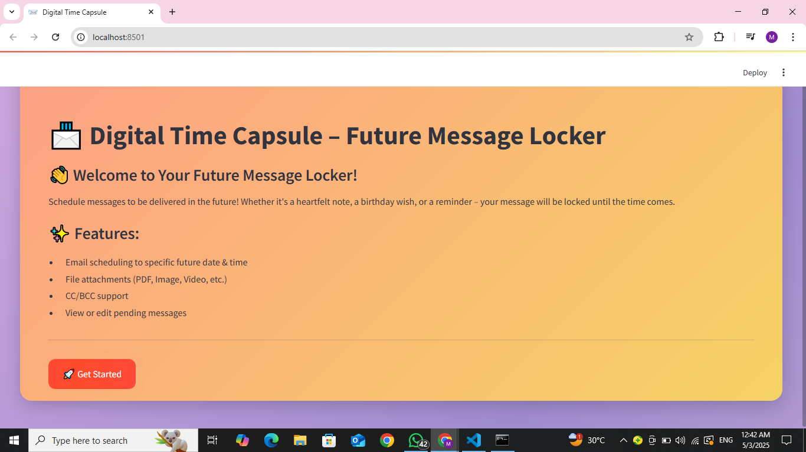
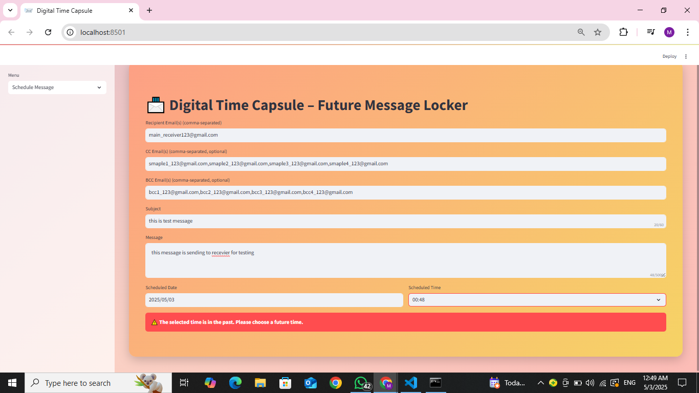
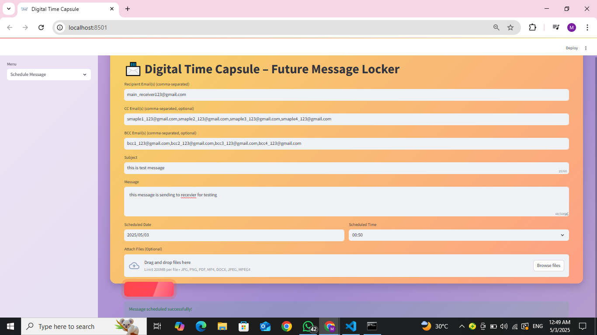
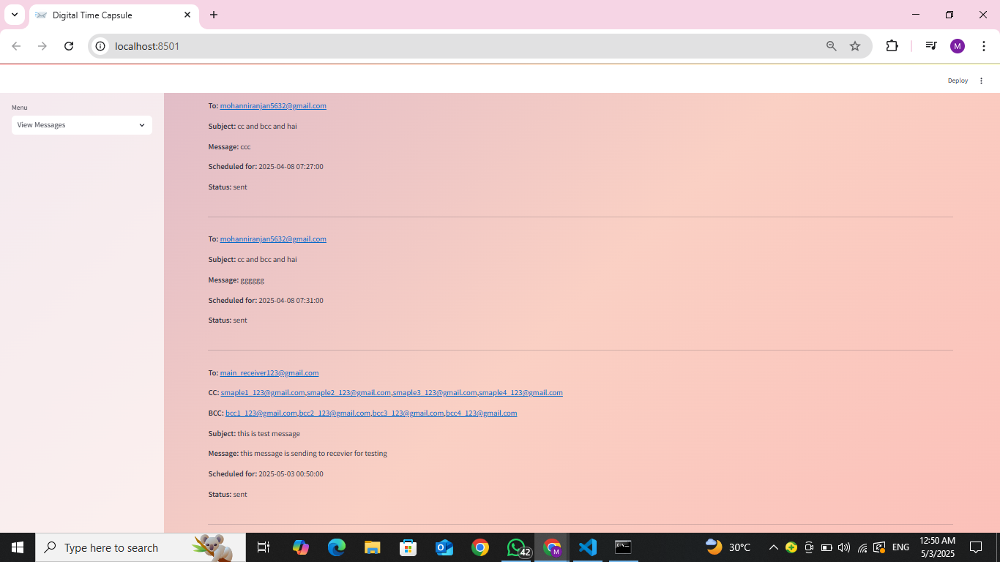

# Digital-Time-Capsule-Future-Email-Scheduler
# 📬 Digital Time Capsule – Future Email Scheduler

A smart and interactive web application that allows users to schedule personalized emails to be sent at a future date and time. With rich features like attachments, CC/BCC support, and secure Gmail SMTP integration, this project functions like a **digital time capsule** — perfect for sending future birthday wishes, reminders, or motivational messages to yourself or others.

---

## ✨ Use Case

Imagine writing a heartfelt letter to your future self or scheduling an important email reminder months ahead. This application empowers users to:

- Lock in thoughts or plans for the future
- Send surprise messages to friends or family
- Create automated workflows with future delivery
- Store and retrieve message history

---

## 🚀 Features

- ⏳ Schedule emails for any future date and time
- 📎 Attach multiple files (images, PDFs, videos, docs)
- ✅ Built-in email address format and domain (MX) validation
- 📬 CC and BCC field support
- 🛠️ Real-time task scheduling using APScheduler
- 🎨 Beautiful gradient-themed UI with animations using custom CSS in Streamlit
- 🔄 Edit or cancel pending messages before they are sent
- 🗃️ MySQL database integration to persist messages

---

## 🛠️ Tech Stack

| Component   | Technology                     |
|-------------|--------------------------------|
| Frontend    | Streamlit + HTML/CSS (custom) |
| Backend     | Python                         |
| Database    | MySQL                          |
| Email API   | Gmail SMTP (smtplib)         |
| Scheduler   | APScheduler                    |
| Utilities   | dnspython, email, os, datetime |

---

digital-time-capsule/
├── email_scheduler_final.py
├── message_final.py
├── uploads/                   # Folder to store uploaded attachments
├── README.md                  # You're about to create this!
├── requirements.txt           # List of dependencies (I'll give this below)
├── .gitignore                 # Files to ignore (I'll give this too)
├── LICENSE                    # MIT License (I'll give this too)

## 1.Edit in both message_final.py and email_scheduler.py
mysql.connector.connect(
    host="localhost",
    user="root",
    password="your-password",
    database="contact_form"
)

##Note
edit email_password =" give your app password"
🔐 Email Authentication Note
To avoid SMTP authentication issues:

Enable 2-Step Verification in your Gmail account.

Go to Google App Passwords and generate a password.

Replace the value of EMAIL_PASSWORD in both Python files

## 2.Install All Packages at Once
Open your terminal or command prompt, navigate to your project folder, and run:
pip install -r requirements.txt

This will automatically install:

-streamlit → for the web interface

-mysql-connector-python → to connect to MySQL

-apscheduler → to schedule emails

-streamlit-autorefresh → to auto-refresh pages in Streamlit

-dnspython → for email domain validation

🔹 ## 3. (Optional) Install Packages Individually
If you prefer to install them one-by-one:
pip install streamlit
pip install mysql-connector-python
pip install apscheduler
pip install streamlit-autorefresh
pip install dnspython

## 4. Run the Streamlit Web App
streamlit run message_final.py

## 5. Start the Email Scheduler (in a second terminal)
python email_scheduler_final.py
🔁 The scheduler checks every minute for emails scheduled for delivery.

## 📸 Screenshots

  
  
  
    
  

